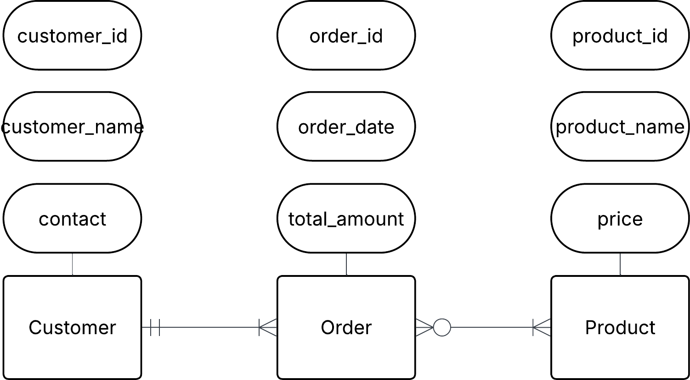

# Exercise 0 - fundamental concepts of data modeling
These exercises are for you to learn fundamental concepts in data modeling. Many of them can be done with pen and paper, physical whiteboard or with an ERD software such as Lucidchart. It is good practice to work analogue as an important part of data modeling is to align various stakeholders with a mix of technical and business knowledge. It is also advised to discuss with your peers as data modeling usually is not done in solitude.

## 0. Library Bookly
A library called Bookly keeps track of books and members who borrow them. Each book has a title, author, and ISBN number. Each member has a membership ID, name, and contact information. A member can borrow multiple books, but each book can be borrowed by only one member at a time.

#### a) Identify the entities and attributes for each entity.
Entities =  Books, member
Attributes = Book (title, author, ISBN number), Member (membership ID, name, contact information)

#### b) Determine the relationship between member and books.

Member "borrows" Books (one-to-many relationship)

#### c) Draw a conceptual ERD using crow foots notation.

## 1. Conceptual ERD to words

This is an ERD conceptual diagram that a database designer and the business stakeholders agreed upon in a car rental company called Carent.

#### a) Describe the entities in this conceptual ERD.
- Entities: Customer, Rental, Car
- Customer: An individual who uses the car rental service. Identified uniquely and provides personal and contact details. Customers can rent multiple cars at multiple times.
- Car: A vegicle owned by the rental company Each car can be uniquely identified and can be rented by different customers at different times.
- Rental: A rental transaction. It describes the event of a customer renting a specific car for a defined time and serves the link between Customer and Car.

#### b) Write out the relationship labels.
- Customer makes Rental
- Rental assigns Car

#### c) Describe the relationships between the entities (one-to-many, one-to-one and many-to-many).

many to many between Customer and Car through Rental.

#### d) Define the relationship statement for example: 
- A customer can make multiple rentals, but each rental is made by one customer.
- A car can be assigned to multiple rentals, but each rental assigns one car.

## 2. University management system

A university needs a system to manage students, courses, and professors.

- each student can enroll in multiple courses.
- each course is taught by one professor.
- a teacher can teach multiple courses.

#### a) Identify entities and their relationships
Student, Course, Teacher

#### b) Come up with possible attributes for the entities
Student (student_id, name, email)
Course (course_id, course_name, credits)
Teacher (teacher_id, name, department)

#### c) Draw conceptual ERD with cardinalities 

#### d) Define business rules (e.g. a student can enroll in max 4 courses)
- A student can enroll in multiple courses, but each course can have 0 or multiple students enrolled.
- A course is taught by one or more professors and a professor can teach multiple courses.

## 3. Onshop
An e-commerce platform Onshop manages customers, orders, and products.

- a customer can place multiple orders.
- each order contains multiple products.
- a product can belong to multiple categories.

#### a) Identify key entities and their attributes (e.g., customer_name, order_date)
Customer (customer_id, customer_name, contact_info)
Order (order_id, order_date, total_amount)
Product (product_id, product_name, price)

#### b) Sketch the conceptual ERD.

#### c) Define business rules
- A customer can place multiple orders, but each order is placed by one and only one customer.
- An order can contain multiple products, and a product can be part of none or multiple orders.

## 4. Theory

| Question | Answer |
|--------|--------|
| **a) What is a conceptual data model, and why is it important?** | A conceptual data model shows *what data exists* and *how entities relate to each other*, without technical details. It is important because it helps stakeholders understand the system before any database is built. |
| **b) Storing age in a database, is that a good idea, why?** | No. Age changes over time. It is better to store **date of birth** and calculate age when needed. This avoids incorrect data. |
| **c) What are the three types of data structures, and how do they differ?** | Structured, semi-structured, and unstructured data. They differ in how organized the data is and how easy it is to query. |
| **d) Give examples of how each data structure is used in real-world applications** | Structured: SQL tables in banking systems. Semi-structured: JSON data from APIs. Unstructured: images, videos, emails, and social media posts. |
| **e) What is cardinality in data modeling, and why is it important?** | Cardinality describes how many instances of one entity relate to another (one-to-one, one-to-many, many-to-many). It is important because it defines correct relationships and prevents data errors. |
| **f) What are the different steps of data modeling?** | Conceptual modeling (high-level view), logical modeling (detailed structure without DB specifics), and physical modeling (actual database implementation). |
| **g) What factors influence the choice between using an RDBMS and NoSQL?** | Data structure, scalability needs, consistency requirements, query complexity, and performance. RDBMS suits structured data and strong consistency, while NoSQL suits flexible schemas and large-scale data. |

## Glossary
| Glossary         | Meaning |
| ---------------- | ------- |
| RDBMS            | A Relational Database Management System. It stores data in tables with rows and columns and uses SQL to manage and query data. |
| relational model | A way of organizing data into tables (relations) with defined relationships between them. |
| conceptual model | A high-level model that shows what data exists and how entities are related, without technical details. |
| logical model    | A detailed model that defines entities, attributes, keys, and relationships, but is not tied to a specific database system. |
| physical model   | The final model that shows how data is actually stored in a database, including tables, columns, data types, and indexes. |
| ERD              | Entity Relationship Diagram. A visual diagram that shows entities, their attributes, and the relationships between them. |
| data modeling    | The process of designing how data is structured, stored, and related in a system. |
| data integrity   | Ensuring that data is accurate, valid, and reliable throughout its lifecycle. |
| data consistency | Ensuring that the same data has the same value across the database at all times. |
| field            | A single piece of data stored in a table column. |
| attribute        | A property or characteristic of an entity, such as name or ID. |
| data type        | Defines what kind of data a field can store, such as integer, text, or date. |
| data redundancy  | The unnecessary duplication of data in multiple places. |
| transaction      | A set of database operations that are executed as a single unit of work. |
| cardinality      | Describes how many instances of one entity are related to another. |
| one-to-one       | A relationship where one record in a table is related to one record in another table. |
| one-to-many      | A relationship where one record in a table is related to many records in another table. |

# Reference
- [Entity Relationship Diagram](https://amycottondmd.wordpress.com/2015/02/23/entity-relationship-diagram/)

- [Crow's Foot](https://www.freecodecamp.org/news/crows-foot-notation-relationship-symbols-and-how-to-read-diagrams/)