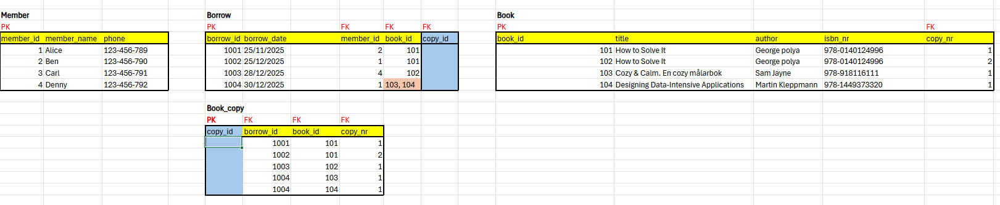
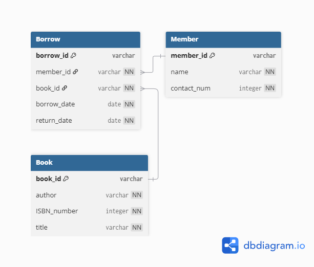
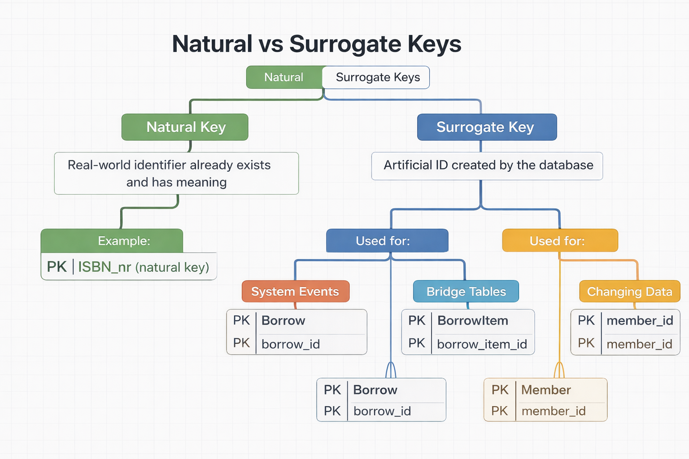

# Exercise 1 - going in to logical and physical data modeling

These exercises are for you to learn fundamental concepts in data modeling. Many of them can be done with pen and paper, physical whiteboard or with an ERD software such as Lucidchart and dbdiagram. It is good practice to work analogue as an important part of data modeling is to align various stakeholders with a mix of technical and business knowledge. It is also advised to discuss with your peers as data modeling usually is not done in solitude.

## Reference materials (Other Github Repository to create logical and physical data models)
[Conceptual ERD](https://github.com/AIgineerAB/data_modeling_course/tree/main/03_erd_conceptual_model)
[Logical and Physical ERD](https://github.com/AIgineerAB/data_modeling_course/tree/main/04_erd_logical_physical_model)
[Database Keys](https://github.com/AIgineerAB/data_modeling_course/tree/main/06_database_keys)
[PostgreSQL Docs](https://www.postgresql.org/docs/current/)

## Class lecture: Book Library

Going back to the library exercise from [exercise0, task 0](https://github.com/AIgineerAB/data_modeling_course/blob/main/exercises/exercise0.md), we will build logical and physical data models. This is the conceptual data model after we've added the composite entities to take care of many-to-many relationships.

#### Create a logical data model using lucidcharts. Identify different keys on the various entities

**Why These Entities Exist (Design Rationale)**
- Book is introduced to satisfy 3NF normalization, avoiding duplication of title/author across copies.
- BookCopy separates logical books from physical inventory.
- BorrowItem exists explicitly to break the M:N relationship between Borrow and BookCopy, enabling:
- Multiple books per borrow transaction
- Future extensibility (e.g., due_date, return_date, fines per item)

| From Entity | To Entity  | Cardinality | Business Meaning                                         |
| ----------- | ---------- | ----------- | -------------------------------------------------------- |
| Member      | Borrow     | 1 → N       | A member can have zero, one, or many borrow transactions |
| Borrow      | Member     | N → 1       | Each borrow belongs to exactly one member                |
| Borrow      | BorrowItem | 1 → N       | A borrow can contain one or many borrowed items          |
| BorrowItem  | Borrow     | N → 1       | Each borrowed item belongs to one borrow                 |
| BookCopy    | BorrowItem | 1 → N       | A book copy can appear in many borrow items over time    |
| BorrowItem  | BookCopy   | N → 1       | Each borrow item references exactly one book copy        |
| Book        | BookCopy   | 1 → N       | A book can have one or many physical copies              |

#### Identify child entities and parent entities. What makes them into parent/child relationships?
| Parent Entity | Child Entity | Relationship Basis |
|---------------|--------------|--------------------|
| Member        | Borrow       | Borrow cannot exist without a Member |
| Book          | Borrow       | Borrow cannot exist without a Book |

#### Create a physical data model using dbdiagram

#### Natural Keys and Surrogate Keys

- A primary key is implemented using either a natural key or a surrogate key; the distinction is conceptual and depends on whether the key has real-world meaning or is system-generated.

| Entity     | Natural Key | Surrogate Key  | Why                                 |
| ---------- | ----------- | -------------- | ----------------------------------- |
| Book       | ISBN_nr     | —              | ISBN is globally unique and stable  |
| BookCopy   | —           | book_id        | Physical copies need artificial IDs |
| Member     | —           | member_id      | Real-world data is unstable         |
| Borrow     | —           | borrow_id      | System event, no natural identifier |
| BorrowItem | —           | borrow_item_id | Bridge table needs simple joins     |

## 0. Hospital example

a) Create a logical data model using lucidcharts

b) Identify different keys on the various entities

c) Identify child entities and parent entities. What makes them into parent/child relationships?

d) Create a physical data model using dbdiagram

e) Create a few tables manually, insert given data plus some more, and try to manually link foreign keys to primary keys. Can you satisfy that a doctor can work at several departments and several hospitals?

## Theory
| Question | Brief Answer |
|--------|--------------|
| a) What are common RDBMS constraints? | **NOT NULL** enforces mandatory values. **UNIQUE** prevents duplicate values. **CHECK** enforces conditional rules. **DEFAULT** assigns a fallback value. **PRIMARY KEY** uniquely identifies a row. **FOREIGN KEY** enforces relationships between tables. |
| b) What does physical modeling have that logical modeling does not? | Physical modeling includes DB-specific details such as data types, indexes, storage structures, performance optimizations, and implementation constraints. |
| c) How do you ensure referential integrity and why is it desirable? | Referential integrity is ensured using **FOREIGN KEY constraints**. It prevents orphan records, preserves data consistency, and enforces valid relationships across tables. |
| d) How do cardinality relationships affect implementation? | Cardinality determines table structure: **1-to-many** uses foreign keys, **many-to-many** requires bridge tables, and **1-to-1** may be merged or constrained depending on design. |
| e) What does domain constraint mean? | A domain constraint restricts the allowed values for a column based on data type, range, format, or predefined rules. |
| f) What is a composite key and when do you use it? | A composite key is a primary key made of multiple columns. It is used when no single column uniquely identifies a row (common in bridge tables). |
| g) What is DBML used for? | DBML is used to define database schemas in a readable text format and generate ER diagrams and SQL code. |

## Glossary
| Term | Meaning |
|------|--------|
| composite entity | An entity that resolves a many-to-many relationship, typically implemented as a bridge table with foreign keys. |
| domain | The set of valid values that an attribute is allowed to have. |
| constraint | A rule enforced by the database to maintain data accuracy and consistency. |
| domain constraint | A rule that restricts the values of an attribute based on type, range, format, or allowed values. |
| entity constraint | A rule that applies at the row level, ensuring each entity instance is uniquely identifiable (e.g., primary key). |
| primary key | A column or set of columns that uniquely identifies each row in a table and cannot be NULL. |
| foreign key | A column that references a primary key in another table to enforce relationships. |
| bridge table | A table used to implement a many-to-many relationship by storing foreign keys from related tables. |
| information engineering | A data modeling methodology focused on structured analysis and clear entity-relationship representation. |
| attributes | Properties or characteristics that describe an entity. |
| data integrity | The overall accuracy, consistency, and reliability of data in a database. |
| entity integrity | Ensures that each table has a primary key and that the key uniquely identifies each row. |
| referential integrity | Ensures that foreign key values correspond to existing primary key values in related tables. |
| relation instance | The actual data (rows) contained in a table at a specific point in time. |
| child entity | An entity that contains a foreign key referencing another entity. |
| parent entity | An entity whose primary key is referenced by a foreign key in another entity. |
| natural key | A key formed from real-world, meaningful data (e.g., ISBN, email). |
| surrogate key | A system-generated key with no business meaning, often an auto-increment ID. |
| candidate key | Any attribute or combination of attributes that can uniquely identify a row. |
| alternate key | A candidate key that was not selected as the primary key. |
